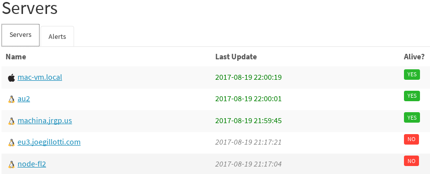
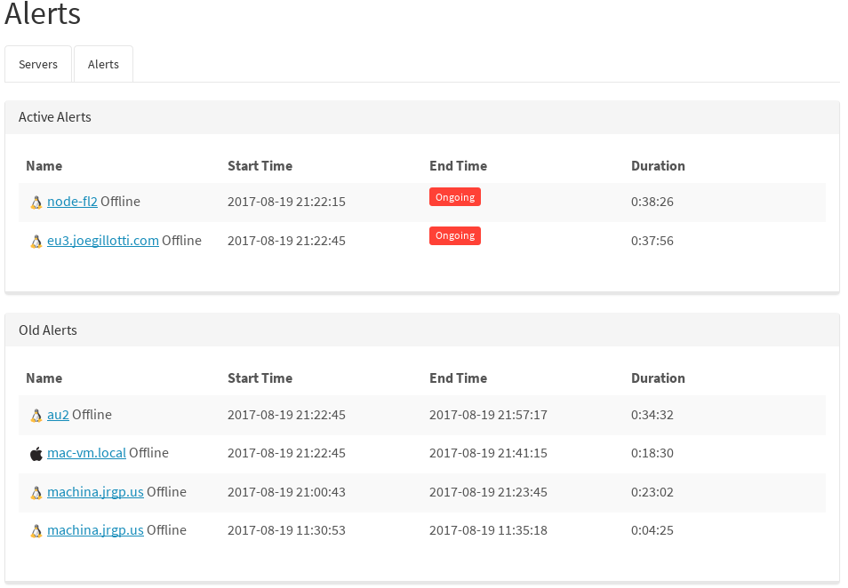

# HealthApp

Open source (MIT) replacement for New Relic's deprecated server health monitoring solution, written in Golang. This will fire alerts and send emails when servers being monitored stop reporting.

## Features

- Intelligent alert lifecycle and processing. 1) Created 2) Ongoing 3) Closed.
- Alerts created when monitoring servers drop out
- Send emails on alerts
- Lightweight with minimal configuration and setup. Only dependency is redis.
- HMAC auth + integrity checking to avoid other people sending you alerts
- Smooth, lightweight single-page-app (SPA) UI, styled with [Bootswatch](https://bootswatch.com/).
- Single-binary deployment, because golang
- Tested on Linux and macOS

## Components

###### API Server

- stateless golang app. you can spin up several behind a balancer.
- listens for updates from server agents
- provides api access to list servers and alerts
- provides web UI (a single page app) which pulls from the API endpoints
  and displays them nicely

###### Alert Processor

- stateful service. only run one of these at once (until i add leader election)
- periodically poll redis for the latest server statuses, and intelligently
  create, maintain, and close alerts as events change
- handles notifications (currently email based) for alert state transitions

###### Agent

- run this on each server that needs to be monitored. periodically POSTs to API Server

###### Redis

- all state (servers, alerts, etc) is stored in redis. If you need this to scale, you can put a proxy in front of a pool of redis servers for durability + sharding.

## Quickstart (for developers)

If you install Go and Glide, after `go get`ing this package and `cd`ing into the folder, you can compile like this:

    glide install
    go build

Copy sample config file. This can be placed in `/etc/healthapp/config.yaml` or any other path specified by `CONFIG_FILE` env var, otherwise `config.yaml` in the current directory.

    cp config.sample.yaml config.yaml

To start API server:

    ./healthapp -serve

To start the alert processor:

    ./healthapp -alerter

To start slave agent:

    ./healthapp -agent

## Prod deployment

If you have [fpm](https://fpm.readthedocs.io/en/latest/index.html) installed, you can build a .deb package using the following. You could even use [quickdebrepo](https://github.com/jrgp/quickdebrepo) to host your own apt repositiory.

    fpm -s dir -t deb -n healthapp -v 0.0.1 --prefix /opt/healthapp healthapp static

Once the resulting deb is installed, HealthApp will be installed to `/opt/healthapp/healthapp` and will accept the arguments as above.

It's recommended you run the API Server behind a reverse proxy, eg apache or nginx, and use that to terminate SSL.

## TODO

- Integrate with [Iris](https://github.com/linkedin/iris/) for notifications, to support others than just email
- UI (CLI or web) for "forgetting" servers which don't exist anymore

## Meta

- MIT licensed
- Open a GitHub issue or email me at joe@u13.net with any questions.
- PRs welcome
